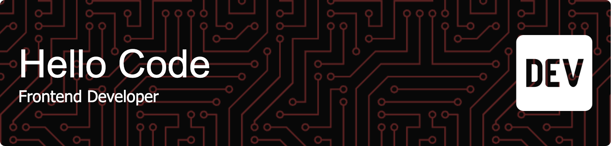

## Hello World! I'm Angga Aprianda 👋

<!--
**anggaaprianda04/anggaaprianda04** is a ✨ _special_ ✨ repository because its `README.md` (this file) appears on your GitHub profile.

Here are some ideas to get you started:

- 🔭 I’m currently working on ...
- 🌱 I’m currently learning ...
- 👯 I’m looking to collaborate on ...
- 🤔 I’m looking for help with ...
- 💬 Ask me about ...
- 📫 How to reach me: ...
- 😄 Pronouns: ...
- ⚡ Fun fact: ...
-->

##### Summary

Graduated in Information and Computer Technology and currently working as a Frontend Developer, specializing in building user-friendly interfaces using React, Vue.js, and other modern JavaScript frameworks.Enthusiastic about Android development with Flutter and modern web applications with Next.js, and continuously staying up-to-date with emerging technologies in the frontend field both web and mobile.

##### Skills

##### My Github Stats

